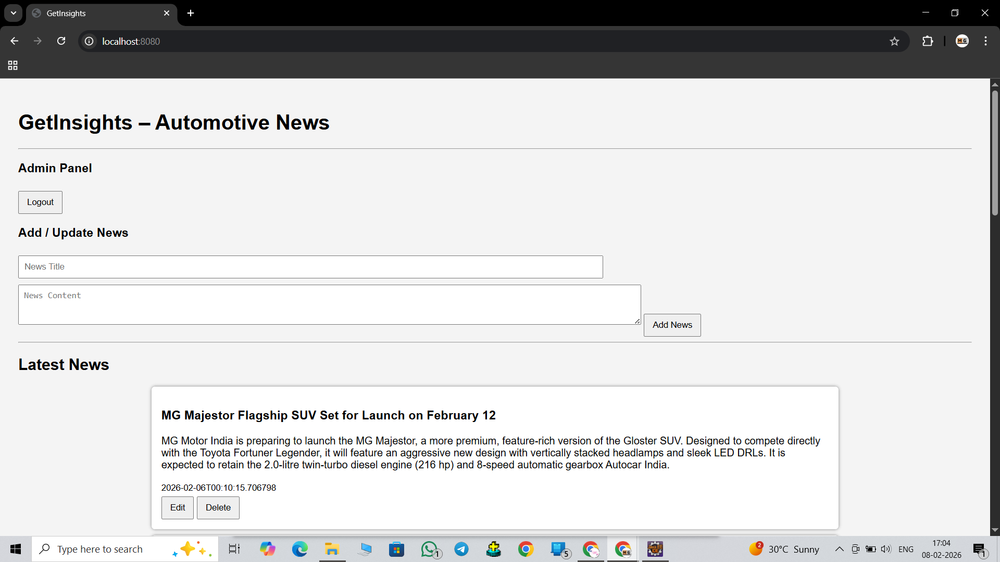

# GetInsights Web Application

GetInsights is a full-stack web application that provides the latest automotive news to users. The platform allows any user to view news articles without logging in, while administrators have the ability to add, update, and delete news content. 

The application is built using Spring Boot for the backend with REST APIs, MySQL for data storage, and HTML, CSS, and JavaScript for the frontend. GetInsights demonstrates a role-based system, dynamic content rendering, and an easy-to-use admin interface, making it a practical project for showcasing full-stack development skills.

---

## Features

### User Features (Public)
- View latest automotive news without registering or logging in.
- News feed displays the latest articles first.
- Proper formatting of news content, including paragraphs and line breaks.

### Admin Features
- Secure admin login to manage content.
- Add new news articles with title and content.
- Edit existing news articles and update content.
- Delete news articles.
- Logout functionality to protect admin access.
- Dynamic UI updates without needing to refresh the page.

### General Features
- Responsive, clean, and simple user interface using HTML, CSS, and JavaScript.
- RESTful backend APIs using Spring Boot.
- Role-based content management (admin vs public user).
- MySQL database for persistent storage.

---

## Tech Stack

### Backend
- **Java** – Core programming language for backend logic.
- **Spring Boot** – Framework for building RESTful APIs.
- **Spring Data JPA** – For database interaction and ORM.
- **MySQL** – Relational database for storing news and admin data.
- **Maven** – Build and dependency management.

### Frontend
- **HTML** – Structure of web pages.
- **CSS** – Styling for responsive and clean UI.
- **JavaScript (Vanilla JS)** – Dynamic content rendering and API calls.

### Tools & IDE
- **Eclipse IDE** – For backend development.
- **Postman** – API testing.
- **MySQL Workbench** – Database design and management.
- **Git & GitHub** – Version control and public repository.

---

## System Architecture / Flow

The GetInsights application follows a layered architecture with clear separation of responsibilities:

1. **Frontend (HTML, CSS, JavaScript)**
   - Provides the user interface for both public users and admin.
   - Fetches data from the backend using REST APIs.
   - Displays news dynamically and handles admin operations like add, update, and delete.

2. **Backend (Spring Boot)**
   - Exposes RESTful APIs to handle all operations.
   - Implements business logic in the Service layer.
   - Uses Controllers to handle HTTP requests from frontend.
   - Performs CRUD operations on the database using Spring Data JPA.

3. **Database (MySQL)**
   - Stores news articles with fields like `id`, `title`, `content`, and `timestamp`.
   - Stores admin credentials for login validation.
   - Supports persistent storage for all data.

**Flow of Operations:**
- **Public User:**
  1. Opens the web page.
  2. Fetches all news via `/news/getAll` API.
  3. Views latest news (latest articles appear first).

- **Admin User:**
  1. Logs in via `/admin/login`.
  2. Accesses admin panel to add, update, or delete news.
  3. Changes are reflected in real-time in the frontend.
  4. Can logout to secure the session.

This layered approach ensures separation of concerns, scalability, and maintainability.

---

## Screenshots

Here are some screenshots of the GetInsights Web Application:

### Public News Feed
  

### Admin Panel
  

---

## 🚀 How to Run the Project

1. Clone the repository.
2. Open the project in Eclipse IDE (or any preferred IDE for Spring Boot).
3. Make sure MySQL is running and update application.properties with your database credentials.
4. Build and run the Spring Boot application.
5. Open a browser and navigate to:
     http://localhost:8080/index.html
6. Admin can login via the login panel to add, update, or delete news.

---

## API Endpoints

### Admin APIs

| Method | Endpoint               | Description                       | Request Body / Params |
|--------|------------------------|-----------------------------------|---------------------|
| POST   | /admin/login           | Admin login                        | `username`, `password` (query params) |
| GET    | /news/getAll           | Fetch all news                     | None |
| POST   | /news/add              | Add a new news article             | `{ "title": "...", "content": "..." }` |
| PUT    | /news/update/{id}      | Update an existing news article    | `{ "title": "...", "content": "..." }` |
| DELETE | /news/delete/{id}      | Delete a news article              | Path param `id` |

### Public APIs

| Method | Endpoint               | Description                       | Request Body / Params |
|--------|------------------------|-----------------------------------|---------------------|
| GET    | /news/getAll           | Fetch all news (public view)      | None |

> **Note:** All admin operations require login. Public users can only view news.

---

## Future Roadmap

- **UI Improvements:**  
  Enhance the frontend with responsive design, modern cards, and better user experience.

- **Spring Security (Session-based):**  
  Secure admin login with proper session handling and role-based access.

- **JWT Authentication:**  
  Implement token-based authentication for API security and future mobile app integration.

- **Hosting / Deployment:**  
  Deploy the web application to a public server (e.g., Railway, Render, AWS) for live access.

- **Android App Integration:**  
  Build a companion Android app that consumes the REST APIs for mobile users.

- **Rich Text / Media Support:**  
  Add support for formatting, images, and multimedia in news articles.

---

## 👤 Author

**Ganeshprabu M**
